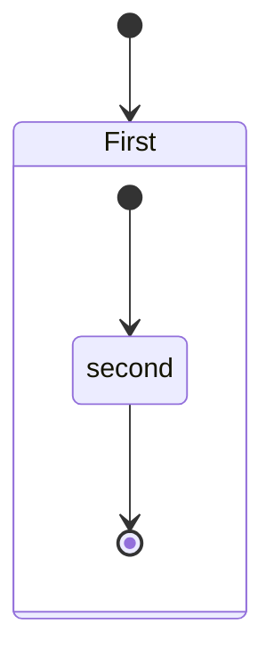
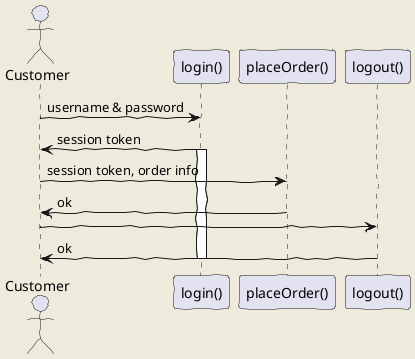

# Инструкция по написанию текстов в MrakDown

## Выделение текстов

В MarkDown есть несколько различных способов выделить текст. 
 glkgkj
Например, Вы можете обрамить слово (или кусок текста) звездочками (*) или нижним подчеркиванием (_) и тогда он будет написан курсивом - *вот так* или _вот так_.

Также вы можете выделить текст полужирным шрифтом, для этого необходимо обрамить текст двойными звездочками (**) или двойными подчеркиванием (__) - **полужирный текст** или __полужирный текст__.

Мы можем комбинировать разные способы выделения полужирным и курсивом. Например, вот так - _Курсивный и одновременно **полужирный текст**_.

## Работа со списками

Списки выбают нумерованными и ненумерованными. Если нам нужен нумерованный список, то мы просто пишем каждый элемент со своим номером на новой строке, а MarkDown сам его красиво оформит. Например, вот так:

1. первый элемент
2. второй элемент
3. третий элемент

Если нам нужны ненумерованные списки, то мы вместо числа (номера элемента) можем поставить +. Например, вот так:

+ Элемент
+ Элемент

## Картинки в тексте

Чтобы добавить картинку в текст необходимо использовать следующий синтаксис - ставим восклицательный знак, потом в квадратных скобках указываем текст, а в круглых - адрес файла с картинкой. Адрес относительный или абсолютный. Например, вот так:


## Ссылки в текста

Ссылка на [GitHub](https://github.com/)

## Таблицы

## Заголовки

Заголовки пишем через #

## Заключение




```python
from sklearn.datasets import load_iris
from sklearn import tree
iris = load_iris()
clf = tree.DecisionTreeClassifier()
clf = clf.fit(iris.data, iris.target)
print(clf.predict_proba(iris.data[:1, :]))
```

Сыллка на [Goglle](https://www.google.ru/)

<h1 style="color:red" align="center">Tectfdfdfdf</h1>

## uml: sequence diagram
Here I will embed PlantUML markup to generate a sequence diagram.

I can include as many plantuml segments as I want in my Markdown, and the diagrams can be of any type supported by PlantUML.

